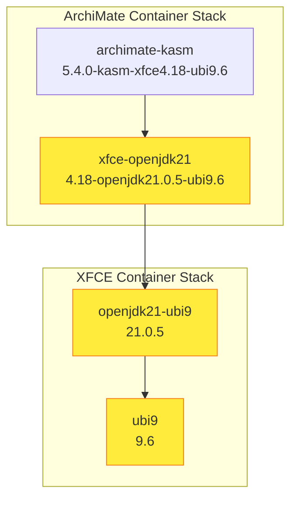

# Iron Bank Repository Review Report

**Repository**: xfce-openjdk-ubi9
**Review Date**: 2026-01-29
**Reviewer**: Automated Iron Bank Compliance Review

---

## Executive Summary

This repository contains two Iron Bank container hardening projects:
1. **XFCE + OpenJDK 21** - Base container with XFCE desktop environment
2. **ArchiMate Tool for KASM** - Enterprise architecture modeling tool for KASM Workspaces

The review identified **critical issues** requiring immediate attention before Iron Bank submission, along with several **version updates** available for key components.

---

## Container Dependency Tree Analysis

Generated using the Iron Bank Tree Traversal skill (`.claude/skills/ironbank_tree.py`).

### Full Dependency Hierarchy



### Dependency Chain Details

| Depth | Container | Repository | Current Tag | Base Image | Status |
|-------|-----------|------------|-------------|------------|--------|
| 0 | archimate-kasm | `opensource/archi/archimate-kasm` | 5.4.0-kasm-xfce4.18-ubi9.6 | xfce-openjdk21 | Root |
| 1 | xfce-openjdk21 | `opensource/xfce/xfce-openjdk21` | 4.18-openjdk21.0.5-ubi9.6 | openjdk21-ubi9 | Update Available |
| 2 | openjdk21-ubi9 | `redhat/openjdk/openjdk21-ubi9` | 21.0.5 | ubi9 | Update Available |
| 3 | ubi9 | `redhat/ubi/9.x/ubi9` | 9.6 | - | Update Available (9.7) |

### Update Propagation Plan

Updates must be applied **bottom-up** to maintain consistency:

1. **Layer 3 (UBI)**: Wait for Iron Bank to publish UBI 9.7 base
2. **Layer 2 (OpenJDK)**: Update `openjdk21-ubi9` when new base available
3. **Layer 1 (XFCE)**: Update `xfce-openjdk21` BASE_TAG and image tags
4. **Layer 0 (ArchiMate)**: Update `archimate-kasm` BASE_TAG and image tags

### Iron Bank Repository Paths

| Container | Iron Bank GitLab Path |
|-----------|----------------------|
| ArchiMate KASM | `https://repo1.dso.mil/dsop/opensource/archi/archimate-kasm` |
| XFCE OpenJDK21 | `https://repo1.dso.mil/dsop/opensource/xfce/xfce-openjdk21` |
| OpenJDK 21 UBI9 | `https://repo1.dso.mil/dsop/redhat/openjdk/openjdk21.x/openjdk21-ubi9` |
| UBI 9 | `https://repo1.dso.mil/dsop/redhat/ubi/9.x/ubi9` |

---

## Critical Issues (Must Fix)

### 1. Placeholder SHA256 Checksums

**Severity**: CRITICAL - Pipeline will fail

Both hardening manifests contain placeholder values instead of actual SHA256 checksums:

**xfce-hardening_manifest.yaml:46**
```yaml
validation:
  type: sha256
  value: "PLACEHOLDER_EPEL_HASH_NEEDS_CALCULATION"
```

**archimate-hardening_manifest.yaml:47**
```yaml
validation:
  type: sha256
  value: "PLACEHOLDER_HASH_NEEDS_CALCULATION"
```

**Required Action**: Calculate actual SHA256 checksums from downloaded resources before submission.

### 2. Placeholder Maintainer Information

**Severity**: HIGH - Submission will be rejected

Both manifests use placeholder maintainer information:
```yaml
maintainers:
- email: "admin@example.com"
  name: "Container Admin"
  username: "container.admin"
```

**Required Action**: Replace with actual Iron Bank container owner information.

---

## Version Updates Available

> **As of 2026-01-29** - Version information below was verified on this date.
> Re-validate all versions immediately before Iron Bank submission using the
> [Re-validation Checklist](#pre-submission-re-validation-checklist) at the end of this section.

### OpenJDK 21 (as of 2026-01-29)

#### Upstream OpenJDK Release

| Upstream Version | Latest Upstream | Status |
|------------------|-----------------|--------|
| 21.0.5 | **21.0.10** | Update Available |

- **Note**: Versions shown (21.0.5, 21.0.10) refer to **upstream OpenJDK semver**, not Iron Bank image tags
- Latest upstream release: January 20, 2026
- Contains critical security patches (CPU)
- Next release: 21.0.11 scheduled for April 21, 2026

**Source**: [OpenJDK January 2026 Critical Patch Update](https://foojay.io/today/openjdk-january-2026-critical-patch-update-and-patch-set-update-released/)

#### Iron Bank Image Reference

| Iron Bank Image | Tag | OpenJDK Patch Level |
|-----------------|-----|---------------------|
| `ironbank/redhat/openjdk/openjdk21.x/openjdk21-runtime-ubi9-slim` | 1.21 | Unknown |

- Iron Bank uses its own tagging scheme (e.g., `1.21`) which does not directly map to upstream OpenJDK versions
- The actual OpenJDK patch level contained in Iron Bank images **cannot be confirmed without authenticated registry access**
- To verify the exact OpenJDK version, inspect the image via: `skopeo inspect` or `docker run ... java -version`
- Monitor [Iron Bank OpenJDK Repository](https://repo1.dso.mil/dsop/redhat/openjdk/) for tag updates

### ArchiMate Tool (Archi) (as of 2026-01-29)

| Current | Latest | Status |
|---------|--------|--------|
| 5.4.0 | **5.7.0** | Update Available |

- Latest release: September 23, 2025
- Supports ArchiMate 3.2 specification
- Multiple releases since 5.4.0 with bug fixes and improvements

**Source**: [Archi 5.7 Released](https://www.archimatetool.com/blog/2025/09/23/archi-5-7-released/)

#### Download Verification

Before calculating SHA256 for the hardening manifest, verify the download using the official SHA-1 checksums:

**SHA-1 Checksum File**: [Archi-5.7.0-SUMSSHA1](https://github.com/archimatetool/archi.io/releases/download/5.7.0/Archi-5.7.0-SUMSSHA1)

```bash
# Download ArchiMate 5.7.0
curl -LO https://github.com/archimatetool/archi.io/releases/download/5.7.0/Archi-Linux-5.7.0.tgz

# Download SHA-1 checksums
curl -LO https://github.com/archimatetool/archi.io/releases/download/5.7.0/Archi-5.7.0-SUMSSHA1

# Verify download (extract Linux checksum and verify)
grep "Archi-Linux-5.7.0.tgz" Archi-5.7.0-SUMSSHA1 | sha1sum -c -

# Generate SHA256 for hardening_manifest.yaml
sha256sum Archi-Linux-5.7.0.tgz
```

#### Updated hardening_manifest.yaml Fields for 5.7.0

```yaml
name: "opensource/archi/archimate-kasm"

tags:
- "5.7.0-kasm-xfce4.18-ubi9.7"
- "5.7.0-kasm-xfce4.18"
- "5.7.0-kasm"
- "latest"

args:
  BASE_IMAGE: "ironbank/opensource/xfce/xfce-openjdk21"
  BASE_TAG: "4.18-openjdk21.0.10-ubi9.7"
  ARCHI_FILENAME: "Archi-Linux-5.7.0.tgz"

labels:
  org.opencontainers.image.version: "5.7.0"

resources:
- url: "https://github.com/archimatetool/archi.io/releases/download/5.7.0/Archi-Linux-5.7.0.tgz"
  filename: "Archi-Linux-5.7.0.tgz"
  validation:
    type: sha256
    value: "<CALCULATE_AFTER_SHA1_VERIFICATION>"
```

**Note**: The download URL pattern changed from `archi/releases` to `archi.io/releases` and filename from `Archi.Linux.gtk.x86_64.tar.gz` to `Archi-Linux-5.7.0.tgz` in version 5.7.0.

### UBI 9 (as of 2026-01-29)

| Current | Latest | Status |
|---------|--------|--------|
| 9.6 | **9.7** | Update Available |

UBI 9.7 is now available. Red Hat rebuilds UBI images on a 6-weekly cadence. This update should be coordinated with the Iron Bank OpenJDK base image updates.

### Pre-Submission Re-validation Checklist

Before submitting to Iron Bank, re-validate all version information using these sources and commands:

#### 1. OpenJDK Version Verification

```bash
# Check Iron Bank OpenJDK repository for latest tags
# (requires authenticated access to repo1.dso.mil)
curl -s "https://repo1.dso.mil/api/v4/projects/dsop%2Fredhat%2Fopenjdk%2Fopenjdk21.x%2Fopenjdk21-runtime-ubi9-slim/repository/tags" | jq '.[0].name'

# Verify actual Java version in Iron Bank image (requires registry access)
skopeo inspect docker://registry1.dso.mil/ironbank/redhat/openjdk/openjdk21.x/openjdk21-runtime-ubi9-slim:latest | jq '.Labels'

# Or run the image to check Java version
docker run --rm registry1.dso.mil/ironbank/redhat/openjdk/openjdk21.x/openjdk21-runtime-ubi9-slim:latest java -version

# Check upstream OpenJDK CVE/CPU pages
# https://openjdk.org/groups/vulnerability/advisories/
# https://www.oracle.com/security-alerts/
```

**Sources**:
- [Iron Bank OpenJDK Repository](https://repo1.dso.mil/dsop/redhat/openjdk/)
- [OpenJDK Security Advisories](https://openjdk.org/groups/vulnerability/advisories/)
- [Oracle Critical Patch Updates](https://www.oracle.com/security-alerts/)

#### 2. ArchiMate Tool Version Verification

```bash
# Check latest Archi release
curl -s https://api.github.com/repos/archimatetool/archi/releases/latest | jq '.tag_name, .published_at'

# Verify download URL and checksum file exist
curl -I https://github.com/archimatetool/archi.io/releases/download/5.7.0/Archi-Linux-5.7.0.tgz
curl -I https://github.com/archimatetool/archi.io/releases/download/5.7.0/Archi-5.7.0-SUMSSHA1
```

**Sources**:
- [Archi GitHub Releases](https://github.com/archimatetool/archi/releases)
- [Archi Official Blog](https://www.archimatetool.com/blog/)
- [Archi Download Page](https://www.archimatetool.com/download/)

#### 3. UBI 9 Version Verification

```bash
# Check Iron Bank UBI repository for latest tags
curl -s "https://repo1.dso.mil/api/v4/projects/dsop%2Fredhat%2Fubi%2F9.x%2Fubi9/repository/tags" | jq '.[0].name'

# Check Red Hat UBI release notes
# https://access.redhat.com/documentation/en-us/red_hat_enterprise_linux/9/html/9.7_release_notes/
```

**Sources**:
- [Iron Bank UBI Repository](https://repo1.dso.mil/dsop/redhat/ubi/9.x/ubi9)
- [Red Hat UBI Release Notes](https://access.redhat.com/documentation/en-us/red_hat_enterprise_linux/9/)
- [Red Hat Container Catalog](https://catalog.redhat.com/software/containers/search)

#### 4. Final Validation Reminder

- [ ] All version numbers verified against sources within 24 hours of submission
- [ ] SHA256 checksums calculated from freshly downloaded files
- [ ] Iron Bank base image tags confirmed available in registry1.dso.mil
- [ ] No new CVEs announced since last verification
- [ ] Maintainer information updated with actual contact details

---

## Iron Bank Compliance Review

### Required Files Checklist

| File | XFCE Container | ArchiMate Container |
|------|----------------|---------------------|
| Dockerfile | Present | Present |
| hardening_manifest.yaml | Present | Present |
| testing_manifest.yaml | Present | Present |
| LICENSE | Present | Present |
| README.md | Present | Present |

### Security Hardening Review

#### XFCE Container (xfce-Dockerfile)

| Requirement | Status | Notes |
|-------------|--------|-------|
| SETUID/SETGID removal | PASS | Line 87: `find / -perm /6000 -type f -exec chmod a-s {} \;` |
| Build tools removed | PASS | Line 62-68: Removes gcc, make, rpm-build, man-db |
| Cache cleanup | PASS | Line 70-71: `dnf clean all && rm -rf /var/cache/dnf` |
| Proper file permissions | PASS | Line 89-92: Secure permissions set |
| Root directory secured | PASS | Line 89: `chmod 700 /root` |

#### ArchiMate Container (archimate-Dockerfile)

| Requirement | Status | Notes |
|-------------|--------|-------|
| Non-root user | PASS | Line 65: `USER 1001` (kasmuser) |
| SETUID/SETGID removal | PASS | Line 43: Removes from /opt/archi |
| Numeric UID | PASS | Uses 1001 (supports random UID) |
| Workspace isolation | PASS | Dedicated ArchiMateWorkspace directory |
| Temp file cleanup | PASS | Line 45: `rm -rf /tmp/* /var/tmp/*` |
| Security context defined | PASS | testing_manifest.yaml includes proper securityContext |

### Dockerfile Best Practices

#### Positive Findings

1. **ARG usage for base images**: Both Dockerfiles properly use ARG for registry, image, and tag
2. **Layer optimization**: Package installs combined in single RUN statements
3. **No secrets in image**: No hardcoded credentials or sensitive data
4. **Proper COPY usage**: Files copied with appropriate permissions
5. **ENTRYPOINT/CMD separation**: Proper use of entrypoint and default command

#### Items to Address

1. **EPEL repository URL**: The EPEL RPM URL should be added to hardening_manifest.yaml resources for offline builds
2. **Subscription manager**: Line 14 attempts subscription-manager which may fail in offline Iron Bank builds

### Testing Manifest Review

#### XFCE testing_manifest.yaml

| Test Category | Tests | Status |
|---------------|-------|--------|
| EPEL Repository | 2 tests | Complete |
| XFCE Desktop | 4 tests | Complete |
| VNC Server | 2 tests | Complete |
| Java Runtime | 2 tests | Complete |
| Security Compliance | 2 tests | Complete |
| Font Installation | 2 tests | Complete |
| Configuration | 2 tests | Complete |
| Kubernetes Config | Complete | Includes probes, resources, env |

#### ArchiMate testing_manifest.yaml

| Test Category | Tests | Status |
|---------------|-------|--------|
| KASM User Config | 4 tests | Complete |
| ArchiMate Installation | 4 tests | Complete |
| XFCE Desktop | 2 tests | Complete |
| Java Runtime | 2 tests | Complete |
| Startup Script | 3 tests | Complete |
| Desktop Config | 3 tests | Complete |
| EPEL Inheritance | 2 tests | Complete |
| Kubernetes Config | Complete | Includes securityContext |

**Assessment**: Testing manifests are comprehensive and well-structured.

### License Compliance

| Component | License | Status |
|-----------|---------|--------|
| XFCE Desktop | GPL-2.0-or-later | Documented |
| OpenJDK | GPL-2.0 with Classpath Exception | Documented |
| Red Hat UBI | Red Hat EULA | Documented |
| ArchiMate Tool | MIT | Documented |
| x11vnc | GPL-2.0+ | Documented |
| Supervisor | BSD-like | Documented |
| Container configs/scripts | Apache 2.0 | Documented |

**Assessment**: License documentation is complete and accurate.

---

## Recommendations

### Immediate Actions (Before Submission)

1. **Calculate SHA256 checksums** for all external resources:
   - EPEL release package
   - ArchiMate Linux archive

2. **Update maintainer information** with actual Iron Bank container owner details

3. **Verify base image paths** match current Iron Bank repository structure:
   - Check: `ironbank/redhat/openjdk/openjdk21-ubi9` vs `ironbank/redhat/openjdk/openjdk21.x/openjdk21-ubi9`

### Version Updates

1. **OpenJDK 21**: Update from 21.0.5 to 21.0.10 when Iron Bank base image is available
   - Monitor: [Iron Bank OpenJDK Repository](https://repo1.dso.mil/dsop/redhat/openjdk/)

2. **ArchiMate Tool**: Update from 5.4.0 to 5.7.0
   - New download URL: `New download URL: `https://github.com/archimatetool/archi.io/releases/download/5.7.0/Archi-Linux-5.7.0.tgz`
   - Update tags, hardening_manifest, and README files

### Documentation Updates

1. Update README files to reflect new versions
2. Update Kubernetes deployment examples with new image tags
3. Ensure all version references are consistent across files

---

## Files Requiring Updates

### For Version Updates

| File | Changes Required |
|------|------------------|
| xfce-hardening_manifest.yaml | BASE_TAG, tags (ubi9.6→ubi9.7), SHA256 hash |
| xfce-Dockerfile | BASE_TAG |
| xfce-README.md | Version references (ubi9.6→ubi9.7) |
| archimate-hardening_manifest.yaml | BASE_TAG, tags (ubi9.6→ubi9.7), ArchiMate URL, SHA256 hash |
| archimate-Dockerfile | BASE_TAG (ubi9.6→ubi9.7) |
| archimate-README.md | Version references (ubi9.6→ubi9.7) |
| PROJECT_ORGANIZATION.md | UBI version reference |

### Files Affected by UBI 9.7 Update

The following files contain references to UBI 9.6 that need updating to 9.7:

| File | Line | Current Value |
|------|------|---------------|
| xfce-hardening_manifest.yaml | 10 | `4.18-openjdk21.0.5-ubi9.6` |
| xfce-README.md | 14, 102, 164 | Multiple UBI 9.6 references |
| archimate-hardening_manifest.yaml | 10, 18 | Tags and BASE_TAG with ubi9.6 |
| archimate-Dockerfile | 7 | `BASE_TAG=4.18-openjdk21.0.5-ubi9.6` |
| archimate-README.md | 16, 46, 106 | Multiple UBI 9.6 references |
| PROJECT_ORGANIZATION.md | 80 | UBI 9.6 reference |

### For Immediate Fixes

| File | Issue |
|------|-------|
| xfce-hardening_manifest.yaml | Placeholder SHA256 hash |
| archimate-hardening_manifest.yaml | Placeholder SHA256 hash |
| Both hardening manifests | Placeholder maintainer info |

---

## Iron Bank Pipeline Considerations

1. **Offline Build Environment**: Ensure all resources are listed in hardening_manifest.yaml
2. **EPEL Repository Access**: EPEL packages are allowed through Iron Bank's proxied package managers
3. **Base Image Dependencies**: Verify openjdk21-ubi9 base image exists and is approved in Iron Bank
4. **SBOM Generation**: Pipeline will automatically generate SPDX/CycloneDX SBOMs

---

## References

- [Iron Bank Documentation](https://docs-ironbank.dso.mil/)
- [Iron Bank Pipeline](https://docs-ironbank.dso.mil/quickstart/pipeline/)
- [Hardening Manifest Schema](https://repo1.dso.mil/ironbank-tools/ironbank-pipeline/-/blob/master/schema/hardening_manifest.schema.json)
- [DoD Container Hardening Guide](https://dl.dod.cyber.mil/wp-content/uploads/devsecops/pdf/Final_DevSecOps_Enterprise_Container_Hardening_Guide_1.2.pdf)
- [OpenJDK Release Schedule](https://wiki.openjdk.org/display/JDKUpdates/JDK+21u)
- [ArchiMate Tool Downloads](https://www.archimatetool.com/download/)

---

## Summary

| Category | Status |
|----------|--------|
| Required Files | PASS |
| Security Hardening | PASS |
| Testing Coverage | PASS |
| License Compliance | PASS |
| Version Currency | **UPDATES AVAILABLE** (OpenJDK 21.0.10, ArchiMate 5.7.0, UBI 9.7) |
| Resource Checksums | **FAIL - Placeholders** |
| Maintainer Info | **FAIL - Placeholders** |

**Overall Assessment**: Repository structure and security hardening are well-implemented. Critical issues with placeholder values must be resolved before Iron Bank submission. Version updates are recommended (OpenJDK 21.0.5→21.0.10, ArchiMate 5.4.0→5.7.0, UBI 9.6→9.7) to ensure latest security patches.
