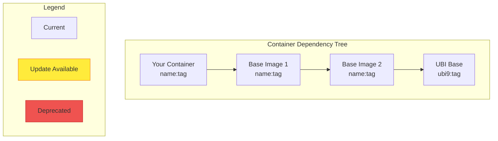

# Iron Bank Container Tree Traversal Skill

## Overview

This skill enables Claude to traverse Iron Bank container dependency trees by analyzing `hardening_manifest.yaml` files. It identifies base images, recursively maps the full dependency chain, detects version updates, and generates visual diagrams and update task plans.

## Environment Variables

| Variable | Default | Description |
|----------|---------|-------------|
| `IRONBANK_REPO_URL` | `https://repo1.dso.mil/dsop` | Base URL for Iron Bank GitLab repositories |
| `IRONBANK_RAW_URL` | `https://repo1.dso.mil/dsop/{path}/-/raw/development/hardening_manifest.yaml` | URL pattern for fetching raw manifest files |

**Note**: Private container images based on Iron Bank may use different repository URLs. Configure `IRONBANK_REPO_URL` to point to your organization's repository if not using the public Iron Bank.

## Skill Instructions

When the user asks to "traverse iron bank tree", "analyze container dependencies", "map container layers", or similar requests, follow these steps:

### Step 1: Identify the Starting Container

1. Check if a local `hardening_manifest.yaml` exists in the current repository
2. If not, ask the user to provide:
   - A path to a local hardening_manifest.yaml, OR
   - An Iron Bank repository path (e.g., `opensource/xfce/xfce-openjdk21`)

### Step 2: Parse the Hardening Manifest

Extract the following information from `hardening_manifest.yaml`:

```yaml
# Key fields to extract:
name: <container_name>
tags:
  - <primary_tag>
args:
  BASE_REGISTRY: <registry_url>
  BASE_IMAGE: <base_image_path>
  BASE_TAG: <base_image_tag>
```

**Parsing Rules:**
- `BASE_IMAGE` contains the path to the parent container (e.g., `ironbank/redhat/openjdk/openjdk21-ubi9`)
- Remove `ironbank/` prefix if present to get the repository path
- `BASE_TAG` identifies the specific version of the parent

### Step 3: Recursively Fetch Parent Manifests

For each base image discovered:

1. Construct the GitLab repository URL:
   ```
   ${IRONBANK_REPO_URL}/${BASE_IMAGE_PATH}
   ```

2. Fetch the `hardening_manifest.yaml` from the `development` branch:
   ```
   ${IRONBANK_REPO_URL}/${BASE_IMAGE_PATH}/-/raw/development/hardening_manifest.yaml
   ```

3. Parse the parent manifest and repeat until reaching a terminal base (e.g., `ubi9`, `scratch`)

4. Track the dependency chain with version information

### Step 4: Check for Version Updates

For each container in the dependency tree:

1. Fetch the latest `hardening_manifest.yaml` from the parent repository
2. Compare the `BASE_TAG` used vs the latest available tag
3. Check if the base image repository still exists (not deprecated/archived)
4. Document any version mismatches or availability issues

### Step 5: Generate Container Layer Diagram

Create a Mermaid diagram showing the container hierarchy:



### Step 6: Generate Update Task Plan

Create a structured task list for updating dependencies:

```markdown
## Update Task Plan

### Priority 1: Base Image Updates (Bottom-Up)
1. [ ] Update UBI base: 9.6 → 9.7
   - Repository: redhat/ubi/9.x/ubi9
   - Impact: All dependent images

### Priority 2: Intermediate Images
2. [ ] Update OpenJDK base: 21.0.5 → 21.0.10
   - Repository: redhat/openjdk/openjdk21.x/openjdk21-ubi9
   - Depends on: UBI 9.7 update
   - Impact: XFCE container, ArchiMate container

### Priority 3: Application Images
3. [ ] Update XFCE container tags
   - Repository: opensource/xfce/xfce-openjdk21
   - Depends on: OpenJDK update

4. [ ] Update ArchiMate container
   - Repository: opensource/archi/archimate-kasm
   - Depends on: XFCE update
```

## Output Format

When executing this skill, generate a report with:

1. **Dependency Tree Summary** - Table of all containers in the chain
2. **Version Analysis** - Current vs latest versions for each layer
3. **Mermaid Diagram** - Visual representation of the tree
4. **Update Task Plan** - Ordered list of update tasks
5. **Risk Assessment** - Impact analysis of updates

## Example Usage

### Input
```
User: Traverse the Iron Bank tree for this repository
```

### Expected Actions

1. Read local `hardening_manifest.yaml` or files in archive
2. Extract BASE_IMAGE: `ironbank/redhat/openjdk/openjdk21-ubi9`
3. Fetch parent manifest from repo1.dso.mil
4. Continue until reaching UBI base
5. Check each layer for version updates
6. Generate diagram and task plan

## API Endpoints Reference

### Fetching Manifest Files

**GitLab Raw File API:**
```
GET ${IRONBANK_REPO_URL}/${repo_path}/-/raw/${branch}/hardening_manifest.yaml
```

**GitLab Repository Info API:**
```
GET ${IRONBANK_REPO_URL}/${repo_path}
```

**GitLab Tags API (for available versions):**
```
GET ${IRONBANK_REPO_URL}/${repo_path}/-/tags
```

## Error Handling

| Scenario | Action |
|----------|--------|
| Manifest not found | Mark as "Not in Iron Bank" or check alternate paths |
| Repository archived | Mark as "Deprecated", suggest replacement |
| Network error | Retry with exponential backoff (2s, 4s, 8s, 16s) |
| Invalid YAML | Report parsing error with line number |
| Circular dependency | Detect and report cycle, stop traversal |

## Data Structures

### Container Node
```yaml
container:
  name: string           # Container name from manifest
  repository: string     # Full repository path
  current_tag: string    # Tag currently in use
  latest_tag: string     # Latest available tag (if different)
  base_image: string     # Parent container path
  base_tag: string       # Parent container tag
  status: enum           # current | update_available | deprecated | not_found
  depth: integer         # Level in dependency tree (0 = root)
```

### Dependency Tree
```yaml
tree:
  root: ContainerNode
  nodes: list[ContainerNode]
  edges: list[{from: string, to: string}]
  max_depth: integer
  update_count: integer
  deprecated_count: integer
```

## Integration with Iron Bank Review

This skill complements the Iron Bank review process by:

1. Validating BASE_IMAGE references exist in Iron Bank
2. Ensuring version consistency across the dependency chain
3. Identifying security update opportunities
4. Planning coordinated multi-repository updates

## Sample Output

```markdown
# Iron Bank Dependency Tree Analysis

## Container: opensource/archi/archimate-kasm

### Dependency Chain

| Depth | Container | Current | Latest | Status |
|-------|-----------|---------|--------|--------|
| 0 | archimate-kasm | 5.4.0-kasm-xfce4.18-ubi9.6 | - | Root |
| 1 | xfce-openjdk21 | 4.18-openjdk21.0.5-ubi9.6 | 4.18-openjdk21.0.10-ubi9.7 | Update Available |
| 2 | openjdk21-ubi9 | 21.0.5 | 21.0.10 | Update Available |
| 3 | ubi9 | 9.6 | 9.7 | Update Available |

### Dependency Diagram

\`\`\`mermaid
graph TD
    A["archimate-kasm<br/>5.4.0-kasm-xfce4.18-ubi9.6"] --> B["xfce-openjdk21<br/>4.18-openjdk21.0.5-ubi9.6"]
    B --> C["openjdk21-ubi9<br/>21.0.5"]
    C --> D["ubi9<br/>9.6"]

    B:::update
    C:::update
    D:::update

    classDef update fill:#ffeb3b,stroke:#f57f17
\`\`\`

### Update Plan

1. **UBI 9.6 → 9.7** (Base layer)
   - Wait for Iron Bank to publish updated openjdk21-ubi9

2. **OpenJDK 21.0.5 → 21.0.10** (Intermediate)
   - Update BASE_TAG in xfce-openjdk21 hardening_manifest.yaml
   - Recalculate SHA256 checksums
   - Update image tags to reflect new versions

3. **XFCE Container** (Intermediate)
   - Update BASE_TAG to new OpenJDK version
   - Update image tags (ubi9.6 → ubi9.7)

4. **ArchiMate Container** (Application)
   - Update BASE_TAG to new XFCE version
   - Update image tags
   - Verify ArchiMate 5.7.0 compatibility
```

## Troubleshooting

### Common Issues

1. **"Access Denied" fetching manifest**
   - Check if repository is private
   - Verify IRONBANK_REPO_URL is correct
   - Some repositories require authentication

2. **"Repository not found"**
   - Iron Bank repository paths change over time
   - Check for `.x` suffix (e.g., `openjdk21.x` vs `openjdk21`)
   - Verify the full path including organization

3. **"Manifest parsing failed"**
   - Check YAML syntax
   - Ensure file is `hardening_manifest.yaml` (not `hardening-manifest.yaml`)
   - Look for encoding issues

## Version History

| Version | Date | Changes |
|---------|------|---------|
| 1.0.0 | 2026-01-29 | Initial skill creation |
