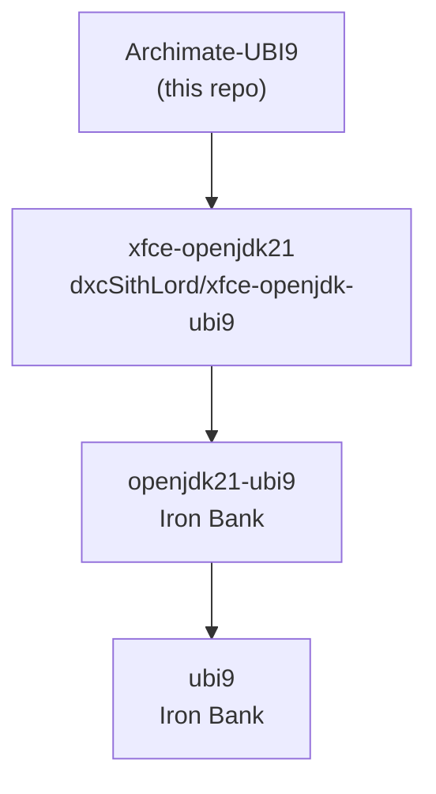

# Iron Bank Tree Traversal Skill - Export Package

This package contains the Iron Bank Tree Traversal skill for use in the [Archimate-UBI9](https://github.com/dxcSithLord/Archimate-UBI9) repository.

## Installation

Copy the contents of this directory to your repository:

```bash
# Clone or navigate to your Archimate-UBI9 repository
cd /path/to/Archimate-UBI9

# Copy the skill files
cp -r /path/to/export-skill/.claude .
cp /path/to/export-skill/CLAUDE.md .
```

Or using curl/wget directly from the source repository:

```bash
# Create directories
mkdir -p .claude/skills

# Download files
curl -o CLAUDE.md https://raw.githubusercontent.com/dxcSithLord/xfce-openjdk-ubi9/main/export-skill/CLAUDE.md
curl -o .claude/skills/ironbank-tree-traversal.md https://raw.githubusercontent.com/dxcSithLord/xfce-openjdk-ubi9/main/export-skill/.claude/skills/ironbank-tree-traversal.md
curl -o .claude/skills/ironbank_tree.py https://raw.githubusercontent.com/dxcSithLord/xfce-openjdk-ubi9/main/export-skill/.claude/skills/ironbank_tree.py

# Make Python script executable
chmod +x .claude/skills/ironbank_tree.py
```

## Contents

```
export-skill/
├── CLAUDE.md                           # Claude Code configuration
├── README.md                           # This file
└── .claude/
    └── skills/
        ├── ironbank-tree-traversal.md  # Skill documentation
        └── ironbank_tree.py            # Python helper script
```

## Usage

Once installed, use these trigger phrases with Claude Code:

- "traverse iron bank tree"
- "analyze container dependencies"
- "map container layers"
- "check iron bank dependencies"
- "ironbank skill"

### Command Line Usage

```bash
# Analyze local hardening manifest
python .claude/skills/ironbank_tree.py hardening_manifest.yaml

# Analyze remote Iron Bank repository
python .claude/skills/ironbank_tree.py opensource/archi/archimate-ubi9

# Output JSON for automation
python .claude/skills/ironbank_tree.py hardening_manifest.yaml --json
```

### Environment Variables

| Variable | Default | Description |
|----------|---------|-------------|
| `IRONBANK_REPO_URL` | `https://repo1.dso.mil/dsop` | Base URL for Iron Bank GitLab |

For private repositories not published to Iron Bank:

```bash
export IRONBANK_REPO_URL="https://your-gitlab.example.com/dsop"
python .claude/skills/ironbank_tree.py your-org/your-container
```

## Container Dependency Chain

The Archimate-UBI9 repository has the following dependency chain:



## ArchiMate 5.7.0 Resources

- **Download**: https://github.com/archimatetool/archi.io/releases/download/5.7.0/Archi-Linux-5.7.0.tgz
- **SHA-1 Checksums**: https://github.com/archimatetool/archi.io/releases/download/5.7.0/Archi-5.7.0-SUMSSHA1
- **Release Notes**: https://www.archimatetool.com/blog/2025/09/23/archi-5-7-released/

## License

Apache License 2.0
